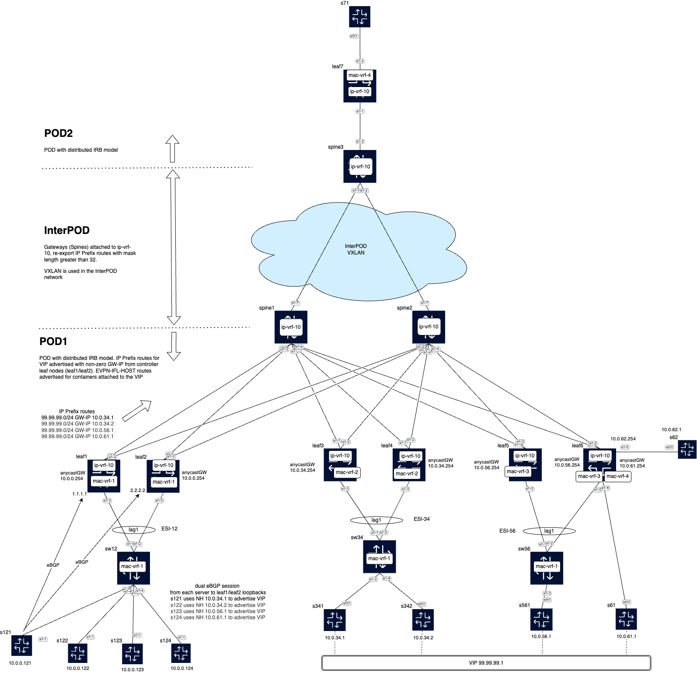

# IP Prefix route GW-IP load balancing and EVPN-IFL vxlan interdomain

The test bed used in this lab is illustrated below.



This lab demonstrates:
- IP prefix route GW-IP load balancing
- EVPN-IFL vxlan interdomain connectivity
- eBGP underlay and overlay in PODs
- ISIS as IGP and iBGP EVPN in the interPOD connectivity

The topology consists of:
- 2 PODs with leaf-spine architecture
- Linux hosts connected to leaves for testing
- Loopback interfaces configured on linux hosts emulating the VIPs

Key configuration elements:
- Underlay in DCs: eBGP unnumbered peering between leafs and spines in the DCs
- Overlay in DC: eBGP EVPN with inter-domain connectivity
- Load balancing across multiple gateway IPs for a VIP 99.99.99.1
- VRF and VXLAN tunnels for tenant isolation

Leaf1 and Leaf2 are connected to "controller" nodes (simulated by SRL nodes running eBGP to the Leaf1 and Leaf2 loopbacks). The controller nodes advertise the VIP network 99.99.99.0/24 with the next-hops of the GW-IP hosts that are attached to different leaf nodes. These next hops are 10.0.34.1, 10.0.34.2, 10.0.56.1 and 10.0.61.1.

Leaf1 and Leaf2 import the eBGP routes, install them in the ip-vrf-10 route-table and re-advertise them as IP Prefix routes, where the GW-IP field encodes the original next hop of the eBGP routes previously advertised by the controllers. Leaf1 and Leaf2 need to have add-paths enabled so that they can advertise four IP Prefix routes (each) with the same route key but different GW-IP.

Leafs 3, 4 5 and 6 are attached to the hosts (10.0.34.1, 10.0.34.2, 10.0.56.1 and 10.0.61.1) that are really connected to the VIP 99.99.99.1 address. They learned these hosts via ARP and advertise them as EVPN-IFL-HOST routes (with or without ESI) that are imported by all remote nodes attached to ip-vrf-10.

Spine1 and Spine2 resolve the VIP 99.99.99.0/24 to the EVPN-IFL-HOST routes.

The Leaf nodes resolve the VIP to EVPN-IFL-HOST and local routes (for the GW-IPs that are locally attached).

In addition, Spine1 and Spine2 are connected to te interPOD network and readvertise IP Prefix routes changing next hops and RD to themselves. The command allow-export is needed for that. Route policies are configured to avoid loops and also to make sure no /32 routes are propagated to the interPOD network.

## Configuration of the Leaf nodes connected to the controllers (Leaf1 and Leaf2)

Leaf1 service configuration is as follows (Leaf2 config is equivalent):

```
--{ candidate shared default }--[ network-instance ip-vrf-10 ]--
A:root@leaf1# info flat
set / network-instance ip-vrf-10 type ip-vrf
set / network-instance ip-vrf-10 admin-state enable
set / network-instance ip-vrf-10 description ip-vrf-10
set / network-instance ip-vrf-10 interface irb0.0
set / network-instance ip-vrf-10 interface lo0.0
set / network-instance ip-vrf-10 vxlan-interface vxlan0.10
set / network-instance ip-vrf-10 protocols bgp-evpn bgp-instance 1 vxlan-interface vxlan0.10
set / network-instance ip-vrf-10 protocols bgp-evpn bgp-instance 1 evi 10
set / network-instance ip-vrf-10 protocols bgp-evpn bgp-instance 1 ecmp 64
set / network-instance ip-vrf-10 protocols bgp-evpn bgp-instance 1 routes route-table ip-prefix evpn-interface-less-gateway-ip advertise
set / network-instance ip-vrf-10 protocols bgp-evpn bgp-instance 1 routes route-table ip-prefix evpn-interface-less-gateway-ip resolve admin-state enable
set / network-instance ip-vrf-10 protocols bgp-evpn bgp-instance 1 routes route-table ip-prefix evpn-interface-less-gateway-ip resolve max-ecmp-hash-buckets-per-next-hop-group 64
set / network-instance ip-vrf-10 protocols bgp admin-state enable
set / network-instance ip-vrf-10 protocols bgp autonomous-system 65001
set / network-instance ip-vrf-10 protocols bgp router-id 1.1.1.1
set / network-instance ip-vrf-10 protocols bgp ebgp-default-policy import-reject-all false
set / network-instance ip-vrf-10 protocols bgp ebgp-default-policy export-reject-all false
set / network-instance ip-vrf-10 protocols bgp afi-safi ipv4-unicast admin-state enable
set / network-instance ip-vrf-10 protocols bgp afi-safi ipv4-unicast multipath allow-multiple-as true
set / network-instance ip-vrf-10 protocols bgp afi-safi ipv4-unicast multipath ebgp maximum-paths 64
set / network-instance ip-vrf-10 protocols bgp afi-safi ipv4-unicast multipath ibgp maximum-paths 64
set / network-instance ip-vrf-10 protocols bgp preference ebgp 160         // this makes sure the eBGP routes are selected over the EVPN routes for the VIP prefix
set / network-instance ip-vrf-10 protocols bgp route-advertisement rapid-withdrawal true
set / network-instance ip-vrf-10 protocols bgp group pe-ce admin-state enable
set / network-instance ip-vrf-10 protocols bgp group pe-ce afi-safi ipv4-unicast admin-state enable
set / network-instance ip-vrf-10 protocols bgp neighbor 10.0.0.121 peer-as 65121
set / network-instance ip-vrf-10 protocols bgp neighbor 10.0.0.121 peer-group pe-ce
set / network-instance ip-vrf-10 protocols bgp neighbor 10.0.0.121 multihop admin-state enable
set / network-instance ip-vrf-10 protocols bgp neighbor 10.0.0.121 multihop maximum-hops 10
set / network-instance ip-vrf-10 protocols bgp neighbor 10.0.0.121 transport local-address 1.1.1.1
set / network-instance ip-vrf-10 protocols bgp neighbor 10.0.0.122 peer-as 65122
set / network-instance ip-vrf-10 protocols bgp neighbor 10.0.0.122 peer-group pe-ce
set / network-instance ip-vrf-10 protocols bgp neighbor 10.0.0.122 multihop admin-state enable
set / network-instance ip-vrf-10 protocols bgp neighbor 10.0.0.122 multihop maximum-hops 10
set / network-instance ip-vrf-10 protocols bgp neighbor 10.0.0.122 transport local-address 1.1.1.1
set / network-instance ip-vrf-10 protocols bgp neighbor 10.0.0.123 peer-as 65123
set / network-instance ip-vrf-10 protocols bgp neighbor 10.0.0.123 peer-group pe-ce
set / network-instance ip-vrf-10 protocols bgp neighbor 10.0.0.123 multihop admin-state enable
set / network-instance ip-vrf-10 protocols bgp neighbor 10.0.0.123 multihop maximum-hops 10
set / network-instance ip-vrf-10 protocols bgp neighbor 10.0.0.123 transport local-address 1.1.1.1
set / network-instance ip-vrf-10 protocols bgp neighbor 10.0.0.124 peer-as 65124
set / network-instance ip-vrf-10 protocols bgp neighbor 10.0.0.124 peer-group pe-ce
set / network-instance ip-vrf-10 protocols bgp neighbor 10.0.0.124 multihop admin-state enable
set / network-instance ip-vrf-10 protocols bgp neighbor 10.0.0.124 multihop maximum-hops 10
set / network-instance ip-vrf-10 protocols bgp neighbor 10.0.0.124 transport local-address 1.1.1.1
set / network-instance ip-vrf-10 protocols bgp-vpn bgp-instance 1 route-target export-rt target:10:10
set / network-instance ip-vrf-10 protocols bgp-vpn bgp-instance 1 route-target import-rt target:10:10
```
## Configuration of the Leaf nodes connected to the GW-IP hosts

The configuration of Leaf3 is as follows (Leaf4 is equivalent):

```
--{ * candidate shared default }--[ network-instance * ]--
A:root@leaf3# info flat | grep default --invert-match | grep mgmt --invert-match
set / network-instance ip-vrf-10 type ip-vrf
set / network-instance ip-vrf-10 admin-state enable
set / network-instance ip-vrf-10 description ip-vrf-10
set / network-instance ip-vrf-10 interface irb0.0
set / network-instance ip-vrf-10 interface lo0.0
set / network-instance ip-vrf-10 vxlan-interface vxlan0.10
set / network-instance ip-vrf-10 protocols bgp-evpn bgp-instance 1 vxlan-interface vxlan0.10
set / network-instance ip-vrf-10 protocols bgp-evpn bgp-instance 1 evi 10
set / network-instance ip-vrf-10 protocols bgp-evpn bgp-instance 1 ecmp 64
set / network-instance ip-vrf-10 protocols bgp-evpn bgp-instance 1 routes route-table ip-prefix evpn-interface-less-gateway-ip advertise
set / network-instance ip-vrf-10 protocols bgp-evpn bgp-instance 1 routes route-table ip-prefix evpn-interface-less-gateway-ip resolve admin-state enable
set / network-instance ip-vrf-10 protocols bgp-evpn bgp-instance 1 routes route-table ip-prefix evpn-interface-less-gateway-ip resolve max-ecmp-hash-buckets-per-next-hop-group 64
set / network-instance ip-vrf-10 protocols bgp-vpn bgp-instance 1 route-target export-rt target:10:10
set / network-instance ip-vrf-10 protocols bgp-vpn bgp-instance 1 route-target import-rt target:10:10
set / network-instance mac-vrf-2 type mac-vrf
set / network-instance mac-vrf-2 admin-state enable
set / network-instance mac-vrf-2 description mac-vrf-2
set / network-instance mac-vrf-2 interface ethernet-1/3.1
set / network-instance mac-vrf-2 interface irb0.0
set / network-instance mac-vrf-2 vxlan-interface vxlan0.2
set / network-instance mac-vrf-2 protocols bgp-evpn bgp-instance 1 vxlan-interface vxlan0.2
set / network-instance mac-vrf-2 protocols bgp-evpn bgp-instance 1 evi 2
set / network-instance mac-vrf-2 protocols bgp-evpn bgp-instance 1 ecmp 8
set / network-instance mac-vrf-2 protocols bgp-evpn bgp-instance 1 routes bridge-table mac-ip advertise-arp-nd-only-with-mac-table-entry true
set / network-instance mac-vrf-2 protocols bgp-vpn bgp-instance 1 route-target export-rt target:2:2
set / network-instance mac-vrf-2 protocols bgp-vpn bgp-instance 1 route-target import-rt target:2:2
set / network-instance mac-vrf-2 bridge-table mac-learning admin-state enable
set / network-instance mac-vrf-2 bridge-table mac-learning aging admin-state enable
set / network-instance mac-vrf-2 bridge-table mac-learning aging age-time 300
```

The configuration of Leaf5 is as follows:

```
--{ * candidate shared default }--[ network-instance * ]--
A:root@leaf5# info flat | grep default --invert-match | grep mgmt --invert-match
set / network-instance ip-vrf-10 type ip-vrf
set / network-instance ip-vrf-10 admin-state enable
set / network-instance ip-vrf-10 description ip-vrf-10
set / network-instance ip-vrf-10 interface irb0.0
set / network-instance ip-vrf-10 interface lo0.0
set / network-instance ip-vrf-10 vxlan-interface vxlan0.10
set / network-instance ip-vrf-10 protocols bgp-evpn bgp-instance 1 vxlan-interface vxlan0.10
set / network-instance ip-vrf-10 protocols bgp-evpn bgp-instance 1 evi 10
set / network-instance ip-vrf-10 protocols bgp-evpn bgp-instance 1 ecmp 64
set / network-instance ip-vrf-10 protocols bgp-evpn bgp-instance 1 routes route-table ip-prefix evpn-interface-less-gateway-ip advertise
set / network-instance ip-vrf-10 protocols bgp-evpn bgp-instance 1 routes route-table ip-prefix evpn-interface-less-gateway-ip resolve admin-state enable
set / network-instance ip-vrf-10 protocols bgp-evpn bgp-instance 1 routes route-table ip-prefix evpn-interface-less-gateway-ip resolve max-ecmp-hash-buckets-per-next-hop-group 64
set / network-instance ip-vrf-10 protocols bgp-vpn bgp-instance 1 route-target export-rt target:10:10
set / network-instance ip-vrf-10 protocols bgp-vpn bgp-instance 1 route-target import-rt target:10:10
set / network-instance ip-vrf-10 next-hop-groups
set / network-instance mac-vrf-3 type mac-vrf
set / network-instance mac-vrf-3 admin-state enable
set / network-instance mac-vrf-3 description mac-vrf-3
set / network-instance mac-vrf-3 interface ethernet-1/3.1
set / network-instance mac-vrf-3 interface irb0.0
set / network-instance mac-vrf-3 vxlan-interface vxlan0.3
set / network-instance mac-vrf-3 protocols bgp-evpn bgp-instance 1 vxlan-interface vxlan0.3
set / network-instance mac-vrf-3 protocols bgp-evpn bgp-instance 1 evi 3
set / network-instance mac-vrf-3 protocols bgp-evpn bgp-instance 1 ecmp 8
set / network-instance mac-vrf-3 protocols bgp-evpn bgp-instance 1 routes bridge-table mac-ip advertise-arp-nd-only-with-mac-table-entry true
set / network-instance mac-vrf-3 protocols bgp-vpn bgp-instance 1 route-target export-rt target:3:3
set / network-instance mac-vrf-3 protocols bgp-vpn bgp-instance 1 route-target import-rt target:3:3
set / network-instance mac-vrf-3 bridge-table mac-learning admin-state enable
set / network-instance mac-vrf-3 bridge-table mac-learning aging admin-state enable
set / network-instance mac-vrf-3 bridge-table mac-learning aging age-time 300
```

The configuration of Leaf6 is as follows:

```
--{ * candidate shared default }--[ network-instance * ]--
A:root@leaf6# info flat | grep default --invert-match | grep mgmt --invert-match
set / network-instance ip-vrf-10 type ip-vrf
set / network-instance ip-vrf-10 admin-state enable
set / network-instance ip-vrf-10 description ip-vrf-10
set / network-instance ip-vrf-10 interface ethernet-1/5.1
set / network-instance ip-vrf-10 interface irb0.0
set / network-instance ip-vrf-10 interface irb0.1
set / network-instance ip-vrf-10 interface lo0.0
set / network-instance ip-vrf-10 vxlan-interface vxlan0.10
set / network-instance ip-vrf-10 protocols bgp-evpn bgp-instance 1 vxlan-interface vxlan0.10
set / network-instance ip-vrf-10 protocols bgp-evpn bgp-instance 1 evi 10
set / network-instance ip-vrf-10 protocols bgp-evpn bgp-instance 1 ecmp 64
set / network-instance ip-vrf-10 protocols bgp-evpn bgp-instance 1 routes route-table ip-prefix evpn-interface-less-gateway-ip advertise
set / network-instance ip-vrf-10 protocols bgp-evpn bgp-instance 1 routes route-table ip-prefix evpn-interface-less-gateway-ip resolve admin-state enable
set / network-instance ip-vrf-10 protocols bgp-evpn bgp-instance 1 routes route-table ip-prefix evpn-interface-less-gateway-ip resolve max-ecmp-hash-buckets-per-next-hop-group 64
set / network-instance ip-vrf-10 protocols bgp-vpn bgp-instance 1 route-target export-rt target:10:10
set / network-instance ip-vrf-10 protocols bgp-vpn bgp-instance 1 route-target import-rt target:10:10
set / network-instance ip-vrf-10 next-hop-groups
set / network-instance mac-vrf-3 type mac-vrf
set / network-instance mac-vrf-3 admin-state enable
set / network-instance mac-vrf-3 description mac-vrf-3
set / network-instance mac-vrf-3 interface ethernet-1/3.1
set / network-instance mac-vrf-3 interface irb0.0
set / network-instance mac-vrf-3 vxlan-interface vxlan0.3
set / network-instance mac-vrf-3 protocols bgp-evpn bgp-instance 1 vxlan-interface vxlan0.3
set / network-instance mac-vrf-3 protocols bgp-evpn bgp-instance 1 evi 3
set / network-instance mac-vrf-3 protocols bgp-evpn bgp-instance 1 ecmp 8
set / network-instance mac-vrf-3 protocols bgp-evpn bgp-instance 1 routes bridge-table mac-ip advertise-arp-nd-only-with-mac-table-entry true
set / network-instance mac-vrf-3 protocols bgp-vpn bgp-instance 1 route-target export-rt target:3:3
set / network-instance mac-vrf-3 protocols bgp-vpn bgp-instance 1 route-target import-rt target:3:3
set / network-instance mac-vrf-3 bridge-table mac-learning admin-state enable
set / network-instance mac-vrf-3 bridge-table mac-learning aging admin-state enable
set / network-instance mac-vrf-3 bridge-table mac-learning aging age-time 300
set / network-instance mac-vrf-4 type mac-vrf
set / network-instance mac-vrf-4 admin-state enable
set / network-instance mac-vrf-4 description mac-vrf-4
set / network-instance mac-vrf-4 interface ethernet-1/4.1
set / network-instance mac-vrf-4 interface irb0.1
set / network-instance mac-vrf-4 vxlan-interface vxlan0.4
set / network-instance mac-vrf-4 protocols bgp-evpn bgp-instance 1 vxlan-interface vxlan0.4
set / network-instance mac-vrf-4 protocols bgp-evpn bgp-instance 1 evi 4
set / network-instance mac-vrf-4 protocols bgp-evpn bgp-instance 1 ecmp 8
set / network-instance mac-vrf-4 protocols bgp-evpn bgp-instance 1 routes bridge-table mac-ip advertise-arp-nd-only-with-mac-table-entry true
set / network-instance mac-vrf-4 protocols bgp-vpn bgp-instance 1 route-target export-rt target:4:4
set / network-instance mac-vrf-4 protocols bgp-vpn bgp-instance 1 route-target import-rt target:4:4
set / network-instance mac-vrf-4 bridge-table mac-learning admin-state enable
set / network-instance mac-vrf-4 bridge-table mac-learning aging admin-state enable
set / network-instance mac-vrf-4 bridge-table mac-learning aging age-time 300
```

## Configuration of the Spine nodes

The spines have the same config. Spine1 config is shown below.

```
-{ candidate shared default }--[ network-instance * ]--
A:root@spine1# info flat | grep default --invert-match | grep mgmt --invert-match
set / network-instance ip-vrf-10 type ip-vrf
set / network-instance ip-vrf-10 admin-state enable
set / network-instance ip-vrf-10 description ip-vrf-10
set / network-instance ip-vrf-10 interface lo0.0
set / network-instance ip-vrf-10 vxlan-interface vxlan0.10
set / network-instance ip-vrf-10 protocols bgp-evpn bgp-instance 1 vxlan-interface vxlan0.10
set / network-instance ip-vrf-10 protocols bgp-evpn bgp-instance 1 evi 10
set / network-instance ip-vrf-10 protocols bgp-evpn bgp-instance 1 ecmp 64
set / network-instance ip-vrf-10 protocols bgp-evpn bgp-instance 1 internal-tags set-tag-set [ tag-10 ]
set / network-instance ip-vrf-10 protocols bgp-evpn bgp-instance 1 routes route-table ip-prefix evpn-interface-less-gateway-ip advertise
set / network-instance ip-vrf-10 protocols bgp-evpn bgp-instance 1 routes route-table ip-prefix evpn-interface-less-gateway-ip resolve admin-state enable
set / network-instance ip-vrf-10 protocols bgp-evpn bgp-instance 1 routes route-table ip-prefix evpn-interface-less-gateway-ip resolve max-ecmp-hash-buckets-per-next-hop-group 64
set / network-instance ip-vrf-10 protocols bgp-vpn allow-export
set / network-instance ip-vrf-10 protocols bgp-vpn bgp-instance 1 route-target export-rt target:10:10
set / network-instance ip-vrf-10 protocols bgp-vpn bgp-instance 1 route-target import-rt target:10:10
```

The default network instance configuration is as follows:

```
--{ candidate shared default }--[ network-instance default ]--
A:root@spine1# info flat
set / network-instance default type default
set / network-instance default admin-state enable
set / network-instance default router-id 11.11.11.11
set / network-instance default ip-forwarding receive-ipv4-check false
set / network-instance default interface ethernet-1/1.0
set / network-instance default interface ethernet-1/2.0
set / network-instance default interface ethernet-1/3.0
set / network-instance default interface ethernet-1/4.0
set / network-instance default interface ethernet-1/5.0
set / network-instance default interface ethernet-1/6.0
set / network-instance default interface ethernet-1/7.0
set / network-instance default interface system0.0
set / network-instance default protocols bgp admin-state enable
set / network-instance default protocols bgp autonomous-system 65500
set / network-instance default protocols bgp router-id 11.11.11.11
set / network-instance default protocols bgp dynamic-neighbors interface ethernet-1/1.0 peer-group bgpgroup-ebgp-dc1
set / network-instance default protocols bgp dynamic-neighbors interface ethernet-1/1.0 allowed-peer-as [ 65001 ]
set / network-instance default protocols bgp dynamic-neighbors interface ethernet-1/2.0 peer-group bgpgroup-ebgp-dc1
set / network-instance default protocols bgp dynamic-neighbors interface ethernet-1/2.0 allowed-peer-as [ 65002 ]
set / network-instance default protocols bgp dynamic-neighbors interface ethernet-1/3.0 peer-group bgpgroup-ebgp-dc1
set / network-instance default protocols bgp dynamic-neighbors interface ethernet-1/3.0 allowed-peer-as [ 65003 ]
set / network-instance default protocols bgp dynamic-neighbors interface ethernet-1/4.0 peer-group bgpgroup-ebgp-dc1
set / network-instance default protocols bgp dynamic-neighbors interface ethernet-1/4.0 allowed-peer-as [ 65004 ]
set / network-instance default protocols bgp dynamic-neighbors interface ethernet-1/5.0 peer-group bgpgroup-ebgp-dc1
set / network-instance default protocols bgp dynamic-neighbors interface ethernet-1/5.0 allowed-peer-as [ 65005 ]
set / network-instance default protocols bgp dynamic-neighbors interface ethernet-1/6.0 peer-group bgpgroup-ebgp-dc1
set / network-instance default protocols bgp dynamic-neighbors interface ethernet-1/6.0 allowed-peer-as [ 65006 ]
set / network-instance default protocols bgp ebgp-default-policy import-reject-all false
set / network-instance default protocols bgp ebgp-default-policy export-reject-all false
set / network-instance default protocols bgp afi-safi evpn admin-state enable
set / network-instance default protocols bgp afi-safi evpn multipath allow-multiple-as true
set / network-instance default protocols bgp afi-safi evpn multipath ebgp maximum-paths 64
set / network-instance default protocols bgp afi-safi evpn multipath ibgp maximum-paths 64
set / network-instance default protocols bgp afi-safi evpn evpn keep-all-routes false
set / network-instance default protocols bgp afi-safi evpn evpn inter-as-vpn true
set / network-instance default protocols bgp afi-safi evpn evpn rapid-update true
set / network-instance default protocols bgp afi-safi ipv4-unicast admin-state enable
set / network-instance default protocols bgp afi-safi ipv4-unicast multipath allow-multiple-as true
set / network-instance default protocols bgp afi-safi ipv4-unicast multipath ebgp maximum-paths 64
set / network-instance default protocols bgp afi-safi ipv4-unicast multipath ibgp maximum-paths 64
set / network-instance default protocols bgp afi-safi ipv4-unicast ipv4-unicast advertise-ipv6-next-hops true
set / network-instance default protocols bgp afi-safi ipv4-unicast ipv4-unicast receive-ipv6-next-hops true
set / network-instance default protocols bgp afi-safi ipv6-unicast admin-state enable
set / network-instance default protocols bgp afi-safi ipv6-unicast multipath allow-multiple-as true
set / network-instance default protocols bgp afi-safi ipv6-unicast multipath ebgp maximum-paths 64
set / network-instance default protocols bgp afi-safi ipv6-unicast multipath ibgp maximum-paths 64
set / network-instance default protocols bgp preference ebgp 170
set / network-instance default protocols bgp preference ibgp 170
set / network-instance default protocols bgp route-advertisement rapid-withdrawal true
set / network-instance default protocols bgp trace-options flag events modifier detail
set / network-instance default protocols bgp trace-options flag packets modifier detail
set / network-instance default protocols bgp trace-options flag open modifier detail
set / network-instance default protocols bgp trace-options flag notification modifier detail
set / network-instance default protocols bgp trace-options flag socket modifier detail
set / network-instance default protocols bgp trace-options flag update modifier detail
set / network-instance default protocols bgp group bgpgroup-ebgp-dc1 admin-state enable
set / network-instance default protocols bgp group bgpgroup-ebgp-dc1 afi-safi evpn admin-state enable
set / network-instance default protocols bgp group bgpgroup-ebgp-dc1 afi-safi evpn export-policy [ export-to-DC ]
set / network-instance default protocols bgp group bgpgroup-ebgp-dc1 afi-safi evpn import-policy [ import-from-DC ]
set / network-instance default protocols bgp group bgpgroup-ebgp-dc1 afi-safi evpn add-paths receive true
set / network-instance default protocols bgp group bgpgroup-ebgp-dc1 afi-safi evpn add-paths send true
set / network-instance default protocols bgp group bgpgroup-ebgp-dc1 afi-safi evpn add-paths send-max 10
set / network-instance default protocols bgp group bgpgroup-ebgp-dc1 afi-safi ipv4-unicast admin-state enable
set / network-instance default protocols bgp group bgpgroup-ebgp-dc1 afi-safi ipv4-unicast export-policy [ export-loopback ]
set / network-instance default protocols bgp group bgpgroup-ebgp-dc1 afi-safi ipv6-unicast admin-state enable
set / network-instance default protocols bgp group bgpgroup-ibgp-wan admin-state enable
set / network-instance default protocols bgp group bgpgroup-ibgp-wan peer-as 65000
set / network-instance default protocols bgp group bgpgroup-ibgp-wan afi-safi evpn admin-state enable
set / network-instance default protocols bgp group bgpgroup-ibgp-wan afi-safi evpn export-policy [ export-to-WAN ]
set / network-instance default protocols bgp group bgpgroup-ibgp-wan afi-safi evpn import-policy [ import-from-WAN ]
set / network-instance default protocols bgp group bgpgroup-ibgp-wan afi-safi ipv4-unicast admin-state disable
set / network-instance default protocols bgp group bgpgroup-ibgp-wan afi-safi ipv6-unicast admin-state disable
set / network-instance default protocols bgp group bgpgroup-ibgp-wan local-as as-number 65000
set / network-instance default protocols bgp group bgpgroup-ibgp-wan transport local-address 11.11.11.11
set / network-instance default protocols bgp neighbor 13.13.13.13 peer-group bgpgroup-ibgp-wan
set / network-instance default protocols isis instance 1 admin-state enable
set / network-instance default protocols isis instance 1 instance-id 1
set / network-instance default protocols isis instance 1 level-capability L2
set / network-instance default protocols isis instance 1 net [ 49.0001.0000.0000.0000.0001.00 ]
set / network-instance default protocols isis instance 1 ipv4-unicast admin-state enable
set / network-instance default protocols isis instance 1 interface ethernet-1/7.0 admin-state enable
set / network-instance default protocols isis instance 1 interface ethernet-1/7.0 circuit-type point-to-point
set / network-instance default protocols isis instance 1 interface ethernet-1/7.0 ipv4-unicast admin-state enable
set / network-instance default protocols isis instance 1 interface ethernet-1/7.0 level 2
set / network-instance default protocols isis instance 1 interface system0.0 admin-state enable
set / network-instance default protocols isis instance 1 interface system0.0 passive true
set / network-instance default protocols isis instance 1 interface system0.0 ipv4-unicast admin-state enable
```

Where policies are configured as follows:

```
-{ candidate shared default }--[ routing-policy ]--
A:root@spine1# info flat
set / routing-policy extended-community-set SOO-12
set / routing-policy extended-community-set SOO-DC-1 member [ origin:1:1 ]
set / routing-policy extended-community-set SOO-WAN-2 member [ origin:2:2 ]
set / routing-policy prefix-set loopback prefix 11.11.11.11/32 mask-length-range 32..32
set / routing-policy prefix-set mask-32-routes prefix 0.0.0.0/0 mask-length-range 32..32
set / routing-policy tag-set tag-10 tag-value [ 10 ]
set / routing-policy policy export-loopback statement 10 match prefix prefix-set loopback
set / routing-policy policy export-loopback statement 10 action policy-result accept
set / routing-policy policy export-to-DC default-action policy-result accept
set / routing-policy policy export-to-DC statement 10 match prefix prefix-set mask-32-routes
set / routing-policy policy export-to-DC statement 10 match internal-tags tag-set [ tag-10 ]
set / routing-policy policy export-to-DC statement 10 action policy-result reject
set / routing-policy policy export-to-DC statement 20 match internal-tags tag-set [ tag-10 ]
set / routing-policy policy export-to-DC statement 20 match bgp extended-community extended-community-set SOO-DC-1
set / routing-policy policy export-to-DC statement 20 action policy-result reject
set / routing-policy policy export-to-DC statement 30 match internal-tags tag-set [ tag-10 ]
set / routing-policy policy export-to-DC statement 30 match bgp extended-community extended-community-set SOO-WAN-2
set / routing-policy policy export-to-DC statement 30 action policy-result accept
set / routing-policy policy export-to-WAN default-action policy-result reject
set / routing-policy policy export-to-WAN statement 10 match prefix prefix-set mask-32-routes
set / routing-policy policy export-to-WAN statement 10 match internal-tags tag-set [ tag-10 ]
set / routing-policy policy export-to-WAN statement 10 action policy-result reject
set / routing-policy policy export-to-WAN statement 20 match internal-tags tag-set [ tag-10 ]
set / routing-policy policy export-to-WAN statement 20 match bgp extended-community extended-community-set SOO-WAN-2
set / routing-policy policy export-to-WAN statement 20 action policy-result reject
set / routing-policy policy export-to-WAN statement 30 match internal-tags tag-set [ tag-10 ]
set / routing-policy policy export-to-WAN statement 30 match bgp extended-community extended-community-set SOO-DC-1
set / routing-policy policy export-to-WAN statement 30 action policy-result accept
set / routing-policy policy import-from-DC statement 10 match family [ evpn ]
set / routing-policy policy import-from-DC statement 10 action policy-result accept
set / routing-policy policy import-from-DC statement 10 action bgp extended-community operation add
set / routing-policy policy import-from-DC statement 10 action bgp extended-community referenced-sets [ SOO-DC-1 ]
set / routing-policy policy import-from-WAN statement 10 match family [ evpn ]
set / routing-policy policy import-from-WAN statement 10 action policy-result accept
set / routing-policy policy import-from-WAN statement 10 action bgp extended-community operation add
set / routing-policy policy import-from-WAN statement 10 action bgp extended-community referenced-sets [ SOO-WAN-2 ]
```

Complete configs can be found in [configs](https://github.com/jorabada/EVPN-IP-Prefix-GW-IP-load-balancing/tree/master/configs)

## Checking the control plane in POD1

Leaf1 and Leaf2 install VIP 99.99.99.0/24 as received from the eBGP PE-CE sessions. They readvertise it as IP Prefix routes with the corresponding GW-IP due to the `evpn-interface-less-gateway-ip advertise` command:

```
--{ candidate shared default }--[ network-instance ip-vrf-10 ]--
A:root@leaf1# show route-table
----------------------------------------------------------------------------------------------------------------------------------------------------------------------------------------------------------------------------------------------------
IPv4 unicast route table of network instance ip-vrf-10
----------------------------------------------------------------------------------------------------------------------------------------------------------------------------------------------------------------------------------------------------
+-------------------------------------+-------+------------+----------------------+----------+----------+---------+------------+-----------------------+-----------------------+-----------------------+-----------------------+
|               Prefix                |  ID   | Route Type |     Route Owner      |  Active  |  Origin  | Metric  |    Pref    |    Next-hop (Type)    |  Next-hop Interface   |    Backup Next-hop    |    Backup Next-hop    |
|                                     |       |            |                      |          | Network  |         |            |                       |                       |        (Type)         |       Interface       |
|                                     |       |            |                      |          | Instance |         |            |                       |                       |                       |                       |
+=====================================+=======+============+======================+==========+==========+=========+============+=======================+=======================+=======================+=======================+
| 1.1.1.1/32                          | 14    | host       | net_inst_mgr         | True     | ip-      | 0       | 0          | None                  | None                  |                       |                       |
|                                     |       |            |                      |          | vrf-10   |         |            |                       |                       |                       |                       |
| 2.2.2.2/32                          | 0     | bgp-evpn   | bgp_evpn_mgr         | True     | ip-      | 0       | 170        | 2.2.2.2/32            |                       |                       |                       |
|                                     |       |            |                      |          | vrf-10   |         |            | (indirect/vxlan)      |                       |                       |                       |
| 3.3.3.3/32                          | 0     | bgp-evpn   | bgp_evpn_mgr         | True     | ip-      | 0       | 170        | 3.3.3.3/32            |                       |                       |                       |
|                                     |       |            |                      |          | vrf-10   |         |            | (indirect/vxlan)      |                       |                       |                       |
| 4.4.4.4/32                          | 0     | bgp-evpn   | bgp_evpn_mgr         | True     | ip-      | 0       | 170        | 4.4.4.4/32            |                       |                       |                       |
|                                     |       |            |                      |          | vrf-10   |         |            | (indirect/vxlan)      |                       |                       |                       |
| 5.5.5.5/32                          | 0     | bgp-evpn   | bgp_evpn_mgr         | True     | ip-      | 0       | 170        | 5.5.5.5/32            |                       |                       |                       |
|                                     |       |            |                      |          | vrf-10   |         |            | (indirect/vxlan)      |                       |                       |                       |
| 6.6.6.6/32                          | 0     | bgp-evpn   | bgp_evpn_mgr         | True     | ip-      | 0       | 170        | 6.6.6.6/32            |                       |                       |                       |
|                                     |       |            |                      |          | vrf-10   |         |            | (indirect/vxlan)      |                       |                       |                       |
| 10.0.0.0/24                         | 0     | bgp-evpn   | bgp_evpn_mgr         | False    | ip-      | 0       | 170        | 2.2.2.2/32            |                       |                       |                       |
|                                     |       |            |                      |          | vrf-10   |         |            | (indirect/vxlan)      |                       |                       |                       |
| 10.0.0.0/24                         | 13    | local      | net_inst_mgr         | True     | ip-      | 0       | 0          | 10.0.0.254 (direct)   | irb0.0                |                       |                       |
|                                     |       |            |                      |          | vrf-10   |         |            |                       |                       |                       |                       |
| 10.0.0.254/32                       | 13    | host       | net_inst_mgr         | True     | ip-      | 0       | 0          | None                  | None                  |                       |                       |
|                                     |       |            |                      |          | vrf-10   |         |            |                       |                       |                       |                       |
| 10.0.0.255/32                       | 13    | host       | net_inst_mgr         | True     | ip-      | 0       | 0          | None                  | None                  |                       |                       |
|                                     |       |            |                      |          | vrf-10   |         |            |                       |                       |                       |                       |
| 10.0.34.0/24                        | 0     | bgp-evpn   | bgp_evpn_mgr         | True     | ip-      | 0       | 170        | 3.3.3.3/32            |                       |                       |                       |
|                                     |       |            |                      |          | vrf-10   |         |            | (indirect/vxlan)      |                       |                       |                       |
|                                     |       |            |                      |          |          |         |            | 4.4.4.4/32            |                       |                       |                       |
|                                     |       |            |                      |          |          |         |            | (indirect/vxlan)      |                       |                       |                       |
| 10.0.34.1/32                        | 0     | bgp-evpn-  | bgp_evpn_ifl_host_mg | True     | ip-      | 0       | 170        | 3.3.3.3/32            |                       |                       |                       |
|                                     |       | ifl-host   | r                    |          | vrf-10   |         |            | (indirect/vxlan)      |                       |                       |                       |
|                                     |       |            |                      |          |          |         |            | 4.4.4.4/32            |                       |                       |                       |
|                                     |       |            |                      |          |          |         |            | (indirect/vxlan)      |                       |                       |                       |
| 10.0.34.2/32                        | 0     | bgp-evpn-  | bgp_evpn_ifl_host_mg | True     | ip-      | 0       | 170        | 3.3.3.3/32            |                       |                       |                       |
|                                     |       | ifl-host   | r                    |          | vrf-10   |         |            | (indirect/vxlan)      |                       |                       |                       |
|                                     |       |            |                      |          |          |         |            | 4.4.4.4/32            |                       |                       |                       |
|                                     |       |            |                      |          |          |         |            | (indirect/vxlan)      |                       |                       |                       |
| 10.0.56.0/24                        | 0     | bgp-evpn   | bgp_evpn_mgr         | True     | ip-      | 0       | 170        | 5.5.5.5/32            |                       |                       |                       |
|                                     |       |            |                      |          | vrf-10   |         |            | (indirect/vxlan)      |                       |                       |                       |
|                                     |       |            |                      |          |          |         |            | 6.6.6.6/32            |                       |                       |                       |
|                                     |       |            |                      |          |          |         |            | (indirect/vxlan)      |                       |                       |                       |
| 10.0.56.1/32                        | 0     | bgp-evpn-  | bgp_evpn_ifl_host_mg | True     | ip-      | 0       | 170        | 5.5.5.5/32            |                       |                       |                       |
|                                     |       | ifl-host   | r                    |          | vrf-10   |         |            | (indirect/vxlan)      |                       |                       |                       |
|                                     |       |            |                      |          |          |         |            | 6.6.6.6/32            |                       |                       |                       |
|                                     |       |            |                      |          |          |         |            | (indirect/vxlan)      |                       |                       |                       |
| 10.0.61.0/24                        | 0     | bgp-evpn   | bgp_evpn_mgr         | True     | ip-      | 0       | 170        | 6.6.6.6/32            |                       |                       |                       |
|                                     |       |            |                      |          | vrf-10   |         |            | (indirect/vxlan)      |                       |                       |                       |
| 10.0.61.1/32                        | 0     | bgp-evpn-  | bgp_evpn_ifl_host_mg | True     | ip-      | 0       | 170        | 6.6.6.6/32            |                       |                       |                       |
|                                     |       | ifl-host   | r                    |          | vrf-10   |         |            | (indirect/vxlan)      |                       |                       |                       |
| 10.0.62.0/24                        | 0     | bgp-evpn   | bgp_evpn_mgr         | True     | ip-      | 0       | 170        | 6.6.6.6/32            |                       |                       |                       |
|                                     |       |            |                      |          | vrf-10   |         |            | (indirect/vxlan)      |                       |                       |                       |
| 10.0.71.0/24                        | 0     | bgp-evpn   | bgp_evpn_mgr         | True     | ip-      | 0       | 170        | 11.11.11.11/32        |                       |                       |                       |
|                                     |       |            |                      |          | vrf-10   |         |            | (indirect/vxlan)      |                       |                       |                       |
|                                     |       |            |                      |          |          |         |            | 12.12.12.12/32        |                       |                       |                       |
|                                     |       |            |                      |          |          |         |            | (indirect/vxlan)      |                       |                       |                       |
| 99.99.99.0/24                       | 0     | bgp        | bgp_mgr              | True     | ip-      | 0       | 160        | 10.0.34.0/24          | ethernet-1/1.0        |                       |                       |
|                                     |       |            |                      |          | vrf-10   |         |            | (indirect/bgp-evpn)   | ethernet-1/2.0        |                       |                       |
|                                     |       |            |                      |          |          |         |            | 10.0.34.0/24          | ethernet-1/1.0        |                       |                       |
|                                     |       |            |                      |          |          |         |            | (indirect/bgp-evpn)   | ethernet-1/2.0        |                       |                       |
|                                     |       |            |                      |          |          |         |            | 10.0.56.0/24          | ethernet-1/1.0        |                       |                       |
|                                     |       |            |                      |          |          |         |            | (indirect/bgp-evpn)   | ethernet-1/2.0        |                       |                       |
|                                     |       |            |                      |          |          |         |            | 10.0.61.0/24          | ethernet-1/1.0        |                       |                       |
|                                     |       |            |                      |          |          |         |            | (indirect/bgp-evpn)   | ethernet-1/2.0        |                       |                       |
|                                     |       |            |                      |          |          |         |            |                       | ethernet-1/1.0        |                       |                       |
|                                     |       |            |                      |          |          |         |            |                       | ethernet-1/2.0        |                       |                       |
|                                     |       |            |                      |          |          |         |            |                       | ethernet-1/1.0        |                       |                       |
|                                     |       |            |                      |          |          |         |            |                       | ethernet-1/2.0        |                       |                       |
|                                     |       |            |                      |          |          |         |            |                       | ethernet-1/1.0        |                       |                       |
|                                     |       |            |                      |          |          |         |            |                       | ethernet-1/2.0        |                       |                       |
| 99.99.99.0/24                       | 0     | bgp-evpn   | bgp_evpn_mgr         | False    | ip-      | 0       | 170        | 5.5.5.5/32            |                       |                       |                       |
|                                     |       |            |                      |          | vrf-10   |         |            | (indirect/vxlan)      |                       |                       |                       |
|                                     |       |            |                      |          |          |         |            | 6.6.6.6/32            |                       |                       |                       |
|                                     |       |            |                      |          |          |         |            | (indirect/vxlan)      |                       |                       |                       |
+-------------------------------------+-------+------------+----------------------+----------+----------+---------+------------+-----------------------+-----------------------+-----------------------+-----------------------+
----------------------------------------------------------------------------------------------------------------------------------------------------------------------------------------------------------------------------------------------------
IPv4 routes total                    : 21
IPv4 prefixes with active routes     : 19
IPv4 prefixes with active ECMP routes: 8
----------------------------------------------------------------------------------------------------------------------------------------------------------------------------------------------------------------------------------------------------

--{ candidate shared default }--[ network-instance ip-vrf-10 ]--
A:root@leaf1# show protocols bgp neighbor *
----------------------------------------------------------------------------------------------------------------------------------------------------------------------------------------------------------------------------------------------------
BGP neighbor summary for network-instance "ip-vrf-10"
Flags: S static, D dynamic, L discovered by LLDP, B BFD enabled, - disabled, * slow
----------------------------------------------------------------------------------------------------------------------------------------------------------------------------------------------------------------------------------------------------
----------------------------------------------------------------------------------------------------------------------------------------------------------------------------------------------------------------------------------------------------
+--------------------------+--------------------------------------+--------------------------+---------+--------------+---------------------+---------------------+-------------------+--------------------------------------+
|         Net-Inst         |                 Peer                 |          Group           |  Flags  |   Peer-AS    |        State        |       Uptime        |     AFI/SAFI      |            [Rx/Active/Tx]            |
+==========================+======================================+==========================+=========+==============+=====================+=====================+===================+======================================+
| ip-vrf-10                | 10.0.0.121                           | pe-ce                    | S       | 65121        | established         | 0d:1h:21m:53s       | ipv4-unicast      | [1/1/0]                              |
| ip-vrf-10                | 10.0.0.122                           | pe-ce                    | S       | 65122        | established         | 0d:1h:21m:46s       | ipv4-unicast      | [1/1/1]                              |
| ip-vrf-10                | 10.0.0.123                           | pe-ce                    | S       | 65123        | established         | 0d:1h:21m:48s       | ipv4-unicast      | [1/1/1]                              |
| ip-vrf-10                | 10.0.0.124                           | pe-ce                    | S       | 65124        | established         | 0d:1h:21m:46s       | ipv4-unicast      | [1/1/1]                              |
+--------------------------+--------------------------------------+--------------------------+---------+--------------+---------------------+---------------------+-------------------+--------------------------------------+
----------------------------------------------------------------------------------------------------------------------------------------------------------------------------------------------------------------------------------------------------
Summary:
4 configured neighbors, 4 configured sessions are established, 0 disabled peers
0 dynamic peers

--{ candidate shared default }--[ network-instance ip-vrf-10 ]--
A:root@leaf1# show protocols bgp routes ipv4 prefix 99.99.99.0/24
----------------------------------------------------------------------------------------------------------------------------------------------------------------------------------------------------------------------------------------------------
Show report for the BGP routes to network "99.99.99.0/24" network-instance  "ip-vrf-10"
----------------------------------------------------------------------------------------------------------------------------------------------------------------------------------------------------------------------------------------------------
Network: 99.99.99.0/24
Received Paths: 4
  Path 1: <Best,Valid,Used,>
    Route source    : neighbor 10.0.0.121
    Route Preference: MED is -, No LocalPref
    BGP next-hop    : 10.0.34.1
    Path            :  i [65121]
    Communities     : None
  Path 2: <Best,Valid,Used,>
    Route source    : neighbor 10.0.0.122
    Route Preference: MED is -, No LocalPref
    BGP next-hop    : 10.0.34.2
    Path            :  i [65122]
    Communities     : None
  Path 3: <Best,Valid,Used,>
    Route source    : neighbor 10.0.0.123
    Route Preference: MED is -, No LocalPref
    BGP next-hop    : 10.0.56.1
    Path            :  i [65123]
    Communities     : None
  Path 4: <Best,Valid,Used,>
    Route source    : neighbor 10.0.0.124
    Route Preference: MED is -, No LocalPref
    BGP next-hop    : 10.0.61.1
    Path            :  i [65124]
    Communities     : None
Path 4 was advertised to: 
[ 10.0.0.122, 10.0.0.123, 10.0.0.124 ]
----------------------------------------------------------------------------------------------------------------------------------------------------------------------------------------------------------------------------------------------------

--{ candidate shared default }--[ network-instance ip-vrf-10 ]--
A:root@leaf1# /show network-instance default protocols bgp neighbor fe80::186a:11ff:feff:1%ethernet-1/1.0 advertised-routes evpn | grep 99.99.99.0
| 1.1.1.1:10                     | 0          | 99.99.99.0/24                                            | 235    | 1.1.1.1                                                  | -                                                        |         |
| 1.1.1.1:10                     | 0          | 99.99.99.0/24                                            | 237    | 1.1.1.1                                                  | -                                                        |         |
| 1.1.1.1:10                     | 0          | 99.99.99.0/24                                            | 239    | 1.1.1.1                                                  | -                                                        |         |
| 1.1.1.1:10                     | 0          | 99.99.99.0/24                                            | 241    | 1.1.1.1                                                  | -                                                        |         |
| 2.2.2.2:10                     | 0          | 99.99.99.0/24                                            | 233    | 2.2.2.2                                                  | -                                                        |         |

```

On Spine1 the VIP prefix is resolved to EVPN-IFL-HOST routes advertised by the leaf nodes attached to the GW-IPs:

```
--{ candidate shared default }--[ network-instance ip-vrf-10 ]--
A:root@spine1# show route-table ipv4-unicast prefix 99.99.99.0/24
----------------------------------------------------------------------------------------------------------------------------------------------------------------------------------------------------------------------------------------------
IPv4 unicast route table of network instance ip-vrf-10
----------------------------------------------------------------------------------------------------------------------------------------------------------------------------------------------------------------------------------------------
+------------------------------------+-------+------------+----------------------+----------+----------+---------+------------+----------------------+----------------------+----------------------+----------------------+
|               Prefix               |  ID   | Route Type |     Route Owner      |  Active  |  Origin  | Metric  |    Pref    |   Next-hop (Type)    |  Next-hop Interface  |   Backup Next-hop    |   Backup Next-hop    |
|                                    |       |            |                      |          | Network  |         |            |                      |                      |        (Type)        |      Interface       |
|                                    |       |            |                      |          | Instance |         |            |                      |                      |                      |                      |
+====================================+=======+============+======================+==========+==========+=========+============+======================+======================+======================+======================+
| 99.99.99.0/24                      | 0     | bgp-evpn   | bgp_evpn_mgr         | True     | ip-      | 0       | 170        | 3.3.3.3/32           |                      |                      |                      |
|                                    |       |            |                      |          | vrf-10   |         |            | (indirect/vxlan)     |                      |                      |                      |
|                                    |       |            |                      |          |          |         |            | 4.4.4.4/32           |                      |                      |                      |
|                                    |       |            |                      |          |          |         |            | (indirect/vxlan)     |                      |                      |                      |
|                                    |       |            |                      |          |          |         |            | 6.6.6.6/32           |                      |                      |                      |
|                                    |       |            |                      |          |          |         |            | (indirect/vxlan)     |                      |                      |                      |
|                                    |       |            |                      |          |          |         |            | 5.5.5.5/32           |                      |                      |                      |
|                                    |       |            |                      |          |          |         |            | (indirect/vxlan)     |                      |                      |                      |
+------------------------------------+-------+------------+----------------------+----------+----------+---------+------------+----------------------+----------------------+----------------------+----------------------+
----------------------------------------------------------------------------------------------------------------------------------------------------------------------------------------------------------------------------------------------
----------------------------------------------------------------------------------------------------------------------------------------------------------------------------------------------------------------------------------------------

--{ candidate shared default }--[ network-instance ip-vrf-10 ]--

--{ candidate shared default }--[ network-instance ip-vrf-10 ]--
A:root@spine1# /show network-instance default protocols bgp routes evpn route-type 5 prefix 99.99.99.0/24 summary | grep -E 'u|w'
Show report for the BGP route table of network-instance "default"
Status codes: u=used, *=valid, >=best, x=stale, b=backup, w=unused-weight-only
BGP Router ID: 11.11.11.11      AS: 65500      Local AS: 65500
Type 5 IP Prefix Routes
| Status |        Route-distinguisher        |   Tag-ID   |     IP-address      |             neighbor              | Path-  |             Next-Hop              |               Label               |              Gateway              |
| u*>    | 1.1.1.1:10                        | 0          | 99.99.99.0/24       | fe80::1895:ff:feff:1%ethernet-    | 235    | 1.1.1.1                           | 10                                | 10.0.34.1                         |
| u*>    | 1.1.1.1:10                        | 0          | 99.99.99.0/24       | fe80::1895:ff:feff:1%ethernet-    | 237    | 1.1.1.1                           | 10                                | 10.0.61.1                         |
| u*>    | 1.1.1.1:10                        | 0          | 99.99.99.0/24       | fe80::1895:ff:feff:1%ethernet-    | 239    | 1.1.1.1                           | 10                                | 10.0.56.1                         |
| w*>    | 1.1.1.1:10                        | 0          | 99.99.99.0/24       | fe80::1895:ff:feff:1%ethernet-    | 241    | 1.1.1.1                           | 10                                | 10.0.34.2                         |
| u*>    | 2.2.2.2:10                        | 0          | 99.99.99.0/24       | fe80::181d:1ff:feff:1%ethernet-   | 297    | 2.2.2.2                           | 10                                | 10.0.56.1                         |
| u*>    | 2.2.2.2:10                        | 0          | 99.99.99.0/24       | fe80::181d:1ff:feff:1%ethernet-   | 300    | 2.2.2.2                           | 10                                | 10.0.34.1                         |
| w*>    | 2.2.2.2:10                        | 0          | 99.99.99.0/24       | fe80::181d:1ff:feff:1%ethernet-   | 330    | 2.2.2.2                           | 10                                | 10.0.34.2                         |
| w*>    | 2.2.2.2:10                        | 0          | 99.99.99.0/24       | fe80::181d:1ff:feff:1%ethernet-   | 335    | 2.2.2.2                           | 10                                | 10.0.61.1                         |
10 IP Prefix routes 5 used, 8 valid, 0 stale

--{ candidate shared default }--[ network-instance ip-vrf-10 ]--

--{ candidate shared default }--[ network-instance ip-vrf-10 ]--
A:root@spine1# show route-table ipv4-unicast prefix 99.99.99.0/24 detail
----------------------------------------------------------------------------------------------------------------------------------------------------------------------------------------------------------------------------------------------
IPv4 unicast route table of network instance ip-vrf-10
----------------------------------------------------------------------------------------------------------------------------------------------------------------------------------------------------------------------------------------------
Destination            : 99.99.99.0/24
ID                     : 0
Route Type             : bgp-evpn
Route Owner            : bgp_evpn_mgr
Origin Network Instance: ip-vrf-10
Metric                 : 0
Preference             : 170
Active                 : true
Last change            : 2025-05-02T11:05:49.602Z
Resilient hash         : false
----------------------------------------------------------------------------------------------------------------------------------------------------------------------------------------------------------------------------------------------
Next hops: 4 entries
3.3.3.3 (indirect) resolved by tunnel to 3.3.3.3/32 (vxlan/tunnel-id: 5) with ECMP weight 2
4.4.4.4 (indirect) resolved by tunnel to 4.4.4.4/32 (vxlan/tunnel-id: 1) with ECMP weight 2
6.6.6.6 (indirect) resolved by tunnel to 6.6.6.6/32 (vxlan/tunnel-id: 6) with ECMP weight 2
5.5.5.5 (indirect) resolved by tunnel to 5.5.5.5/32 (vxlan/tunnel-id: 3) with ECMP weight 1
Backup Next hops: 0 entries

----------------------------------------------------------------------------------------------------------------------------------------------------------------------------------------------------------------------------------------------
----------------------------------------------------------------------------------------------------------------------------------------------------------------------------------------------------------------------------------------------
Route Programming Status
----------------------------------------------------------------------------------------------------------------------------------------------------------------------------------------------------------------------------------------------
Suppressed                        : false
Last successful FIB operation     : modify
Last successful FIB operation time: 2025-05-02T11:05:49.602Z
Current FIB operation pending     : none
Last failed FIB operation         : none
----------------------------------------------------------------------------------------------------------------------------------------------------------------------------------------------------------------------------------------------
Primary NHG
----------------------------------------------------------------------------------------------------------------------------------------------------------------------------------------------------------------------------------------------
----------------------------------------------------------------------------------------------------------------------------------------------------------------------------------------------------------------------------------------------
Backup NHG
----------------------------------------------------------------------------------------------------------------------------------------------------------------------------------------------------------------------------------------------

--{ candidate shared default }--[ network-instance ip-vrf-10 ]--

--{ candidate shared default }--[ network-instance ip-vrf-10 ]--
A:root@spine1# show route-table ipv4-unicast route 10.0.34.1
----------------------------------------------------------------------------------------------------------------------------------------------------------------------------------------------------------------------------------------------
IPv4 unicast route table of network instance ip-vrf-10
----------------------------------------------------------------------------------------------------------------------------------------------------------------------------------------------------------------------------------------------
+------------------------------------+-------+------------+----------------------+----------+----------+---------+------------+----------------------+----------------------+----------------------+----------------------+
|               Prefix               |  ID   | Route Type |     Route Owner      |  Active  |  Origin  | Metric  |    Pref    |   Next-hop (Type)    |  Next-hop Interface  |   Backup Next-hop    |   Backup Next-hop    |
|                                    |       |            |                      |          | Network  |         |            |                      |                      |        (Type)        |      Interface       |
|                                    |       |            |                      |          | Instance |         |            |                      |                      |                      |                      |
+====================================+=======+============+======================+==========+==========+=========+============+======================+======================+======================+======================+
| 10.0.34.1/32                       | 0     | bgp-evpn-  | bgp_evpn_ifl_host_mg | True     | ip-      | 0       | 170        | 3.3.3.3/32           |                      |                      |                      |
|                                    |       | ifl-host   | r                    |          | vrf-10   |         |            | (indirect/vxlan)     |                      |                      |                      |
|                                    |       |            |                      |          |          |         |            | 4.4.4.4/32           |                      |                      |                      |
|                                    |       |            |                      |          |          |         |            | (indirect/vxlan)     |                      |                      |                      |
+------------------------------------+-------+------------+----------------------+----------+----------+---------+------------+----------------------+----------------------+----------------------+----------------------+
----------------------------------------------------------------------------------------------------------------------------------------------------------------------------------------------------------------------------------------------
----------------------------------------------------------------------------------------------------------------------------------------------------------------------------------------------------------------------------------------------

--{ candidate shared default }--[ network-instance ip-vrf-10 ]--
A:root@spine1# show route-table ipv4-unicast route 10.0.34.2
----------------------------------------------------------------------------------------------------------------------------------------------------------------------------------------------------------------------------------------------
IPv4 unicast route table of network instance ip-vrf-10
----------------------------------------------------------------------------------------------------------------------------------------------------------------------------------------------------------------------------------------------
+------------------------------------+-------+------------+----------------------+----------+----------+---------+------------+----------------------+----------------------+----------------------+----------------------+
|               Prefix               |  ID   | Route Type |     Route Owner      |  Active  |  Origin  | Metric  |    Pref    |   Next-hop (Type)    |  Next-hop Interface  |   Backup Next-hop    |   Backup Next-hop    |
|                                    |       |            |                      |          | Network  |         |            |                      |                      |        (Type)        |      Interface       |
|                                    |       |            |                      |          | Instance |         |            |                      |                      |                      |                      |
+====================================+=======+============+======================+==========+==========+=========+============+======================+======================+======================+======================+
| 10.0.34.2/32                       | 0     | bgp-evpn-  | bgp_evpn_ifl_host_mg | True     | ip-      | 0       | 170        | 3.3.3.3/32           |                      |                      |                      |
|                                    |       | ifl-host   | r                    |          | vrf-10   |         |            | (indirect/vxlan)     |                      |                      |                      |
|                                    |       |            |                      |          |          |         |            | 4.4.4.4/32           |                      |                      |                      |
|                                    |       |            |                      |          |          |         |            | (indirect/vxlan)     |                      |                      |                      |
+------------------------------------+-------+------------+----------------------+----------+----------+---------+------------+----------------------+----------------------+----------------------+----------------------+
----------------------------------------------------------------------------------------------------------------------------------------------------------------------------------------------------------------------------------------------
----------------------------------------------------------------------------------------------------------------------------------------------------------------------------------------------------------------------------------------------

--{ candidate shared default }--[ network-instance ip-vrf-10 ]--
A:root@spine1# show route-table ipv4-unicast route 10.0.56.1
----------------------------------------------------------------------------------------------------------------------------------------------------------------------------------------------------------------------------------------------
IPv4 unicast route table of network instance ip-vrf-10
----------------------------------------------------------------------------------------------------------------------------------------------------------------------------------------------------------------------------------------------
+------------------------------------+-------+------------+----------------------+----------+----------+---------+------------+----------------------+----------------------+----------------------+----------------------+
|               Prefix               |  ID   | Route Type |     Route Owner      |  Active  |  Origin  | Metric  |    Pref    |   Next-hop (Type)    |  Next-hop Interface  |   Backup Next-hop    |   Backup Next-hop    |
|                                    |       |            |                      |          | Network  |         |            |                      |                      |        (Type)        |      Interface       |
|                                    |       |            |                      |          | Instance |         |            |                      |                      |                      |                      |
+====================================+=======+============+======================+==========+==========+=========+============+======================+======================+======================+======================+
| 10.0.56.1/32                       | 0     | bgp-evpn-  | bgp_evpn_ifl_host_mg | True     | ip-      | 0       | 170        | 5.5.5.5/32           |                      |                      |                      |
|                                    |       | ifl-host   | r                    |          | vrf-10   |         |            | (indirect/vxlan)     |                      |                      |                      |
|                                    |       |            |                      |          |          |         |            | 6.6.6.6/32           |                      |                      |                      |
|                                    |       |            |                      |          |          |         |            | (indirect/vxlan)     |                      |                      |                      |
+------------------------------------+-------+------------+----------------------+----------+----------+---------+------------+----------------------+----------------------+----------------------+----------------------+
----------------------------------------------------------------------------------------------------------------------------------------------------------------------------------------------------------------------------------------------
----------------------------------------------------------------------------------------------------------------------------------------------------------------------------------------------------------------------------------------------

--{ candidate shared default }--[ network-instance ip-vrf-10 ]--
A:root@spine1# show route-table ipv4-unicast route 10.0.61.1
----------------------------------------------------------------------------------------------------------------------------------------------------------------------------------------------------------------------------------------------
IPv4 unicast route table of network instance ip-vrf-10
----------------------------------------------------------------------------------------------------------------------------------------------------------------------------------------------------------------------------------------------
+------------------------------------+-------+------------+----------------------+----------+----------+---------+------------+----------------------+----------------------+----------------------+----------------------+
|               Prefix               |  ID   | Route Type |     Route Owner      |  Active  |  Origin  | Metric  |    Pref    |   Next-hop (Type)    |  Next-hop Interface  |   Backup Next-hop    |   Backup Next-hop    |
|                                    |       |            |                      |          | Network  |         |            |                      |                      |        (Type)        |      Interface       |
|                                    |       |            |                      |          | Instance |         |            |                      |                      |                      |                      |
+====================================+=======+============+======================+==========+==========+=========+============+======================+======================+======================+======================+
| 10.0.61.1/32                       | 0     | bgp-evpn-  | bgp_evpn_ifl_host_mg | True     | ip-      | 0       | 170        | 6.6.6.6/32           |                      |                      |                      |
|                                    |       | ifl-host   | r                    |          | vrf-10   |         |            | (indirect/vxlan)     |                      |                      |                      |
+------------------------------------+-------+------------+----------------------+----------+----------+---------+------------+----------------------+----------------------+----------------------+----------------------+
----------------------------------------------------------------------------------------------------------------------------------------------------------------------------------------------------------------------------------------------
----------------------------------------------------------------------------------------------------------------------------------------------------------------------------------------------------------------------------------------------

--{ candidate shared default }--[ network-instance ip-vrf-10 ]--

```

On the Leaf nodes connected to the GW-IPs, the VIP prefix is resolved to a combination of EVPN-IFL-HOST routes from other nodes and local irbs for the local GW-IPs. Example in Leaf3:

```
--{ * candidate shared default }--[ network-instance ip-vrf-10 ]--
A:root@leaf3# show route-table ipv4-unicast prefix 99.99.99.0/24
------------------------------------------------------------------------------------------------------------------------------------------------------------------------------
IPv4 unicast route table of network instance ip-vrf-10
------------------------------------------------------------------------------------------------------------------------------------------------------------------------------
+-----------------------+-------+------------+----------------------+----------+----------+---------+------------+--------------+--------------+--------------+--------------+
|        Prefix         |  ID   | Route Type |     Route Owner      |  Active  |  Origin  | Metric  |    Pref    |   Next-hop   |   Next-hop   | Backup Next- | Backup Next- |
|                       |       |            |                      |          | Network  |         |            |    (Type)    |  Interface   |  hop (Type)  |     hop      |
|                       |       |            |                      |          | Instance |         |            |              |              |              |  Interface   |
+=======================+=======+============+======================+==========+==========+=========+============+==============+==============+==============+==============+
| 99.99.99.0/24         | 0     | bgp-evpn   | bgp_evpn_mgr         | True     | ip-      | 0       | 170        | 10.0.34.0/24 | irb0.0       |              |              |
|                       |       |            |                      |          | vrf-10   |         |            | (indirect/lo |              |              |              |
|                       |       |            |                      |          |          |         |            | cal)         |              |              |              |
|                       |       |            |                      |          |          |         |            | 6.6.6.6/32 ( | irb0.0       |              |              |
|                       |       |            |                      |          |          |         |            | indirect/vxl |              |              |              |
|                       |       |            |                      |          |          |         |            | an)          |              |              |              |
|                       |       |            |                      |          |          |         |            | 5.5.5.5/32 ( |              |              |              |
|                       |       |            |                      |          |          |         |            | indirect/vxl |              |              |              |
|                       |       |            |                      |          |          |         |            | an)          |              |              |              |
|                       |       |            |                      |          |          |         |            | 10.0.34.0/24 |              |              |              |
|                       |       |            |                      |          |          |         |            | (indirect/lo |              |              |              |
|                       |       |            |                      |          |          |         |            | cal)         |              |              |              |
+-----------------------+-------+------------+----------------------+----------+----------+---------+------------+--------------+--------------+--------------+--------------+
------------------------------------------------------------------------------------------------------------------------------------------------------------------------------
------------------------------------------------------------------------------------------------------------------------------------------------------------------------------

--{ * candidate shared default }--[ network-instance ip-vrf-10 ]--
A:root@leaf3# show route-table ipv4-unicast prefix 99.99.99.0/24 su
Parsing error: Unknown token 'su'. Options are ['!!', '!!!', '#', '>', '>>', 'delete', 'detail', 'insert', 'or-longer', 'set', '{', '|']

--{ * candidate shared default }--[ network-instance ip-vrf-10 ]--
A:root@leaf3# show route-table ipv4-unicast prefix 99.99.99.0/24 detail
------------------------------------------------------------------------------------------------------------------------------------------------------------------------------
IPv4 unicast route table of network instance ip-vrf-10
------------------------------------------------------------------------------------------------------------------------------------------------------------------------------
Destination            : 99.99.99.0/24
ID                     : 0
Route Type             : bgp-evpn
Route Owner            : bgp_evpn_mgr
Origin Network Instance: ip-vrf-10
Metric                 : 0
Preference             : 170
Active                 : true
Last change            : 2025-05-02T11:05:49.606Z
Resilient hash         : false
------------------------------------------------------------------------------------------------------------------------------------------------------------------------------
Next hops: 4 entries
10.0.34.1 (indirect) resolved by route to 10.0.34.0/24 (local) with ECMP weight 1
  via 10.0.34.1 (direct) via [irb0.0]
6.6.6.6 (indirect) resolved by tunnel to 6.6.6.6/32 (vxlan/tunnel-id: 5) with ECMP weight 4
5.5.5.5 (indirect) resolved by tunnel to 5.5.5.5/32 (vxlan/tunnel-id: 2) with ECMP weight 2
10.0.34.2 (indirect) resolved by route to 10.0.34.0/24 (local) with ECMP weight 2
  via 10.0.34.2 (direct) via [irb0.0]
Backup Next hops: 0 entries

------------------------------------------------------------------------------------------------------------------------------------------------------------------------------
------------------------------------------------------------------------------------------------------------------------------------------------------------------------------
Route Programming Status
------------------------------------------------------------------------------------------------------------------------------------------------------------------------------
Suppressed                        : false
Last successful FIB operation     : modify
Last successful FIB operation time: 2025-05-02T11:05:49.606Z
Current FIB operation pending     : none
Last failed FIB operation         : none
------------------------------------------------------------------------------------------------------------------------------------------------------------------------------
Primary NHG
------------------------------------------------------------------------------------------------------------------------------------------------------------------------------
------------------------------------------------------------------------------------------------------------------------------------------------------------------------------
Backup NHG
------------------------------------------------------------------------------------------------------------------------------------------------------------------------------


--{ * candidate shared default }--[ network-instance ip-vrf-10 ]--
A:root@leaf3# show route-table ipv4-unicast route 10.0.34.1
------------------------------------------------------------------------------------------------------------------------------------------------------------------------------
IPv4 unicast route table of network instance ip-vrf-10
------------------------------------------------------------------------------------------------------------------------------------------------------------------------------
+-----------------------+-------+------------+----------------------+----------+----------+---------+------------+--------------+--------------+--------------+--------------+
|        Prefix         |  ID   | Route Type |     Route Owner      |  Active  |  Origin  | Metric  |    Pref    |   Next-hop   |   Next-hop   | Backup Next- | Backup Next- |
|                       |       |            |                      |          | Network  |         |            |    (Type)    |  Interface   |  hop (Type)  |     hop      |
|                       |       |            |                      |          | Instance |         |            |              |              |              |  Interface   |
+=======================+=======+============+======================+==========+==========+=========+============+==============+==============+==============+==============+
| 10.0.34.0/24          | 4     | local      | net_inst_mgr         | True     | ip-      | 0       | 0          | 10.0.34.254  | irb0.0       |              |              |
|                       |       |            |                      |          | vrf-10   |         |            | (direct)     |              |              |              |
+-----------------------+-------+------------+----------------------+----------+----------+---------+------------+--------------+--------------+--------------+--------------+
------------------------------------------------------------------------------------------------------------------------------------------------------------------------------
------------------------------------------------------------------------------------------------------------------------------------------------------------------------------

--{ * candidate shared default }--[ network-instance ip-vrf-10 ]--
A:root@leaf3# show route-table ipv4-unicast route 10.0.34.2
------------------------------------------------------------------------------------------------------------------------------------------------------------------------------
IPv4 unicast route table of network instance ip-vrf-10
------------------------------------------------------------------------------------------------------------------------------------------------------------------------------
+-----------------------+-------+------------+----------------------+----------+----------+---------+------------+--------------+--------------+--------------+--------------+
|        Prefix         |  ID   | Route Type |     Route Owner      |  Active  |  Origin  | Metric  |    Pref    |   Next-hop   |   Next-hop   | Backup Next- | Backup Next- |
|                       |       |            |                      |          | Network  |         |            |    (Type)    |  Interface   |  hop (Type)  |     hop      |
|                       |       |            |                      |          | Instance |         |            |              |              |              |  Interface   |
+=======================+=======+============+======================+==========+==========+=========+============+==============+==============+==============+==============+
| 10.0.34.0/24          | 4     | local      | net_inst_mgr         | True     | ip-      | 0       | 0          | 10.0.34.254  | irb0.0       |              |              |
|                       |       |            |                      |          | vrf-10   |         |            | (direct)     |              |              |              |
+-----------------------+-------+------------+----------------------+----------+----------+---------+------------+--------------+--------------+--------------+--------------+
------------------------------------------------------------------------------------------------------------------------------------------------------------------------------
------------------------------------------------------------------------------------------------------------------------------------------------------------------------------

--{ * candidate shared default }--[ network-instance ip-vrf-10 ]--
A:root@leaf3# show route-table ipv4-unicast route 10.0.56.1
------------------------------------------------------------------------------------------------------------------------------------------------------------------------------
IPv4 unicast route table of network instance ip-vrf-10
------------------------------------------------------------------------------------------------------------------------------------------------------------------------------
+-----------------------+-------+------------+----------------------+----------+----------+---------+------------+--------------+--------------+--------------+--------------+
|        Prefix         |  ID   | Route Type |     Route Owner      |  Active  |  Origin  | Metric  |    Pref    |   Next-hop   |   Next-hop   | Backup Next- | Backup Next- |
|                       |       |            |                      |          | Network  |         |            |    (Type)    |  Interface   |  hop (Type)  |     hop      |
|                       |       |            |                      |          | Instance |         |            |              |              |              |  Interface   |
+=======================+=======+============+======================+==========+==========+=========+============+==============+==============+==============+==============+
| 10.0.56.1/32          | 0     | bgp-evpn-  | bgp_evpn_ifl_host_mg | True     | ip-      | 0       | 170        | 5.5.5.5/32 ( |              |              |              |
|                       |       | ifl-host   | r                    |          | vrf-10   |         |            | indirect/vxl |              |              |              |
|                       |       |            |                      |          |          |         |            | an)          |              |              |              |
|                       |       |            |                      |          |          |         |            | 6.6.6.6/32 ( |              |              |              |
|                       |       |            |                      |          |          |         |            | indirect/vxl |              |              |              |
|                       |       |            |                      |          |          |         |            | an)          |              |              |              |
+-----------------------+-------+------------+----------------------+----------+----------+---------+------------+--------------+--------------+--------------+--------------+
------------------------------------------------------------------------------------------------------------------------------------------------------------------------------
------------------------------------------------------------------------------------------------------------------------------------------------------------------------------

--{ * candidate shared default }--[ network-instance ip-vrf-10 ]--
A:root@leaf3# show route-table ipv4-unicast route 10.0.61.1
------------------------------------------------------------------------------------------------------------------------------------------------------------------------------
IPv4 unicast route table of network instance ip-vrf-10
------------------------------------------------------------------------------------------------------------------------------------------------------------------------------
+-----------------------+-------+------------+----------------------+----------+----------+---------+------------+--------------+--------------+--------------+--------------+
|        Prefix         |  ID   | Route Type |     Route Owner      |  Active  |  Origin  | Metric  |    Pref    |   Next-hop   |   Next-hop   | Backup Next- | Backup Next- |
|                       |       |            |                      |          | Network  |         |            |    (Type)    |  Interface   |  hop (Type)  |     hop      |
|                       |       |            |                      |          | Instance |         |            |              |              |              |  Interface   |
+=======================+=======+============+======================+==========+==========+=========+============+==============+==============+==============+==============+
| 10.0.61.1/32          | 0     | bgp-evpn-  | bgp_evpn_ifl_host_mg | True     | ip-      | 0       | 170        | 6.6.6.6/32 ( |              |              |              |
|                       |       | ifl-host   | r                    |          | vrf-10   |         |            | indirect/vxl |              |              |              |
|                       |       |            |                      |          |          |         |            | an)          |              |              |              |
+-----------------------+-------+------------+----------------------+----------+----------+---------+------------+--------------+--------------+--------------+--------------+
------------------------------------------------------------------------------------------------------------------------------------------------------------------------------
------------------------------------------------------------------------------------------------------------------------------------------------------------------------------

--{ * candidate shared default }--[ network-instance ip-vrf-10 ]--
```


## Miscellaneous 

The following alias is used to display traces:

```
environment alias display-trace "bash viewlog -f /var/log/srlinux/debug/trace_events_other.log -t -e {}"
```

